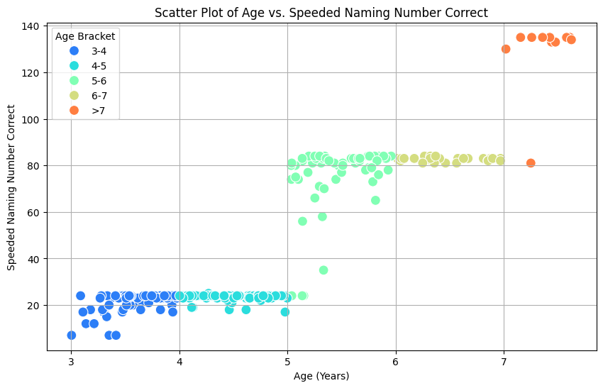
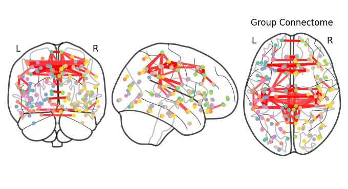

<!-- This is an html comment and this won't appear in the rendered page. You are now editing the "content" area, the core of your description. Everything that you can do in markdown is allowed below. We added a couple of comments to guide your through documenting your progress. -->

## Project definition

### Background

Resting-state functional connectivity (RSFC) reflects the brain’s intrinsic network organization in the absence of task demands. Prior research has shown that children with developmental dyslexia (DD) exhibit reduced connectivity between left temporal-frontal regions—key areas for language processing—and increased connectivity within the default mode network (DMN) compared to typically developing (TD) readers (Schurz et al., 2015). This project aims to investigate the relationship between RSFC and early phonological and language abilities in preschool-aged children.

### Tools

This project used:
 * Python (Google Colab) & Excel
 * `nilearn` for ROI-wise extraction and brain visualization 
 * `pandas` & `numpy` for data analysis
 * `matplotlib` & `seaborn` for data visualization

### Data

Reynolds, J., Long, X., Paniukov, D., Bagshawe, M., Dewey, D., & Lebel, C. (2023, June 13). Calgary Preschool MRI Dataset. https://doi.org/10.17605/OSF.IO/AXZ5R

### Deliverables

- Project slide: https://docs.google.com/presentation/d/1Qv_kKj4uIC7enOUea1mDupAcgzFz-JtHmtoqQdst6L8/edit?usp=sharing
- Scatter plot 'age vs. speed naming number corrected'
- Whole-brain RSFC connectome
- Correlation between network strength and behavioral scores

## Results

### Progress overview

The project was swiftly initiated by P Bellec, based on the existing template created in 2019 by Tristan Glatard and improved by different students. It was really not that hard. Community feedback is expected to lead to rapid further improvements of this first version.

### Tools I learned during this project

- `nilearn` atlas-based ROI extraction & brain connectome plotting
- `pandas` & `numpy` data cleaning & analysis; correlation matrix with fMRI signals to behavioral data
- `matplotlib` & `seaborn` for data visualization

### Results

#### Deliverable 1: Age vs. speed naming number of corrected items
The dataset only indicated that different speed-naming tasks were used for participants of different ages, but it did not specify which tasks were used. Only by plotting the items corrected for each age bracket did I infer that the same task was used for the 3–5, 5–7, and 7+ age groups.

#### Deliverable 2: Whole-brain RSFC connectome

##### 
#### Deliverable 3: Instructions

## Discussion
- The lack of significant results may be due to the small sample size (n = 15) and limited variability in behavioral measures (i.e., small standard deviations).
- The effects of repeated measurements should be considered in future analyses.
- It is worth noting that 'passive viewing' ≠ 'resting state'; the original dataset did not record which movie participants were passively viewing during scanning.
